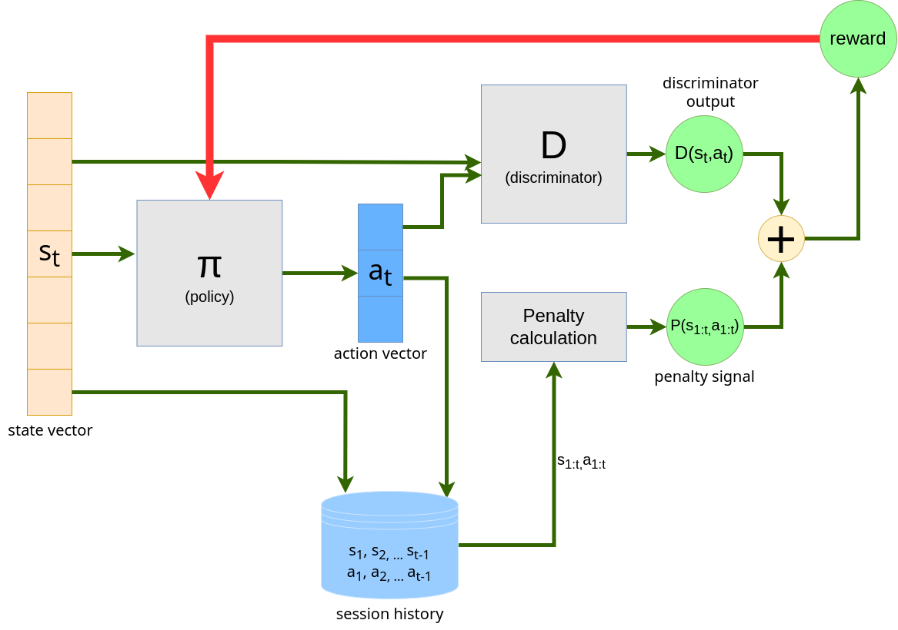

# AdvEDA: An Advanced Automatic End to End EDA Approach



This repository contains experiments for training and testing adversarial imitation learning based models for performing automated exploratory data analysis.

In this work, we propose an end-to-end
EDA approach that does not explicitly rely on any human-defined interestingness measures and yet captures all the essential aspects of data analysis from expert EDA notebooks (trajectories). To achieve this goal, we use an imitation learning framework that tries to learn
the optimal policy for EDA using expert EDA notebooks. In particular, we use generative adversarial imitation learning (GAIL) to
model the problem. We also introduce a ’STOP’ action to allow
the algorithm to stop the EDA process when it is most suited. It
also prevents the model from taking unwanted actions when the
majority of the analysis is done. The use of GAIL allows the model
to learn well even when the number of expert trajectories is small.
The proposed approach automatically generalizes over different
datasets following the same schema. We observe that the proposed
method outperforms the state-of-the-art end-to-end EDA approach
on various performance metrics. More importantly, we observe that
the actions taken at every step of the EDA sessions (generated us-
ing the learned model with the proposed approach) follow various
interestingness measures as a byproduct.

## Setup

```sh
pip install -r requirements.txt
```

## Overview

- `AnalysisEnv.py` - Implementation of the Gym-like environment for data analysis.

- `benchmarking.py` - Contains helper methods to get benchmarking scores for a trained agent. Uses benchmarking methods from `./benchmark/` which is the ATENA benchmark folder.

- `raw_datasets/` - Raw datasets of network traffic data.

- `session_repositories/` - Raw data of expert actions.

- `expert_trajectories/` - Vectorized expert trajectories obtained after preprocessing, stored in pickled form.

- `train.py` - Main script for training

## Training a GAIL agent

Training config is specified in `config_classes.py` with examples in the `exoeriments/` folder.

```sh
python train.py
```

Agents get saved to `./saved_agents/`.

## Running Benchmarks

Benchmarking methods are implemented in `benchmarking.py`.

Automatic benchmarking can be performed using `run_benchmark.py`
